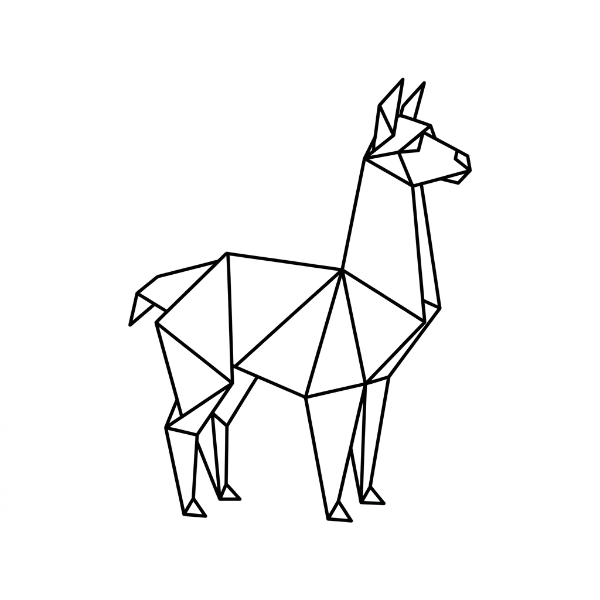

<p align="center">
  
</p>

# Paper Llama

Paper Llama is a companion application for **Paperless-ngx**. Using an external LLM running on
**Ollama** or **Llama.cpp**, it evaluates the content of your newly scanned documents and
automatically generates and assigns appropriate **Title**, **Correspondent**, **Document Type**,
**Tags** and **Creation Date**. The success rate of assigning the correct values is much better with
an external LLM than with the built-in functionality of Paperless-ngx.

To avoid cluttering your Paperless instance configuration, it will only use the existing
Correspondents, Document Types and Tags by default. You can change this behavior on a per-metadata
type basis in the settings to allow the AI to generate new values if it didn't find a good match.

## Setup & Run

### Option 1: Docker (Recommended)

You can deploy Paper Llama using Docker Compose. A basic `docker-compose.yml` file is provided in
the repository. I recommend using a permanent volume for the database (/data) to persist the list of
processed documents.

```bash
docker-compose up -d
```

The app will be available on port `8021`.

### Option 2: Local Development

Ensure you have Python 3.10+ and Node.js installed.

1. **Install Backend Dependencies:**
    ```bash
    python -m venv venv
    source venv/Scripts/activate # Windows users use: .\venv\Scripts\activate
    pip install -r requirements.txt
    ```
2. **Setup Frontend Environments:** _(Ensure you have `npm` installed if you intend to run frontend
   tests)_
    ```bash
    npm install
    ```
3. **Run the Server:**
    ```bash
    uvicorn backend.main:app --host 0.0.0.0 --port 8021 --reload
    ```

Navigate to `http://localhost:8021` to access the Setup Wizard.

## Configuration Settings

Once you complete the initial setup wizard, you can tweak the application settings directly from the
Dashboard.

- **Paperless API Credentials:** The connection URL and Token for your Paperless-ngx instance. I
  recommend to create a dedicated user in Paperless with the following permissions:
    - View and Edit Documents
    - View Tags, Correspondents, Document Types, Users, Groups
    - All access to Saved Views and UI settings (for testing, e.g. checking what the user can see)
    - Add Tags, Correspondents, Document Types if you enable AI generation for them

    To create and get the token for the user in Paperless, log in with the user and open "My
    Profile" from the top right menu.

    **Important:** The user must have access to all documents and metadata that you want to process.
    E.g. the change document access is not enough if the document has an owner set and the Paper
    LLama user is not added as an editor either directly or via a group.

- **AI Backend:** Currently supported are Ollama and Llama.cpp.
- **Ollama AI Config:** Enter the base URL to your local Ollama deployment (e.g.
  `http://localhost:11434`), select the LLM model from the models that are current available on your
  instance (I had good results with `gpt-oss:20b` and more recently with `gemma-4-E4B` on modest
  hardware), and the timeout in seconds.
- **Llama.cpp AI Config:** The base URL to your local Llama.cpp deployment (e.g.
  `http://localhost:8080`), the LLM model, and the timeout in seconds.
- **AI Capabilities Checkboxes:** Choose exactly which fields the AI assistant is allowed to modify.
  Currently available: Title, Correspondent, Document Type, Tags and Creation Date. By default, it
  will only use the existing values and if it can't find a match it will leave the field unchanged.
  If "Allow AI generation" is enabled for a field, it will try to generate new value(s) for it if it
  couldn't find a good match.
- **Metadata Permissions:** When you enable AI generation for a field e.g. tags, by default the
  newly created tag will be owned by the user that Paper Llama is configured to use and it may not
  be visible to other users. Paper LLama can be configured to apply custom permissions when creating
  new metadata.
- **AI Vision Fallback:** Choose between "off", "on" and "force".
    - "off": Process the text content of the document, as stored in Paperless.
    - "on": Process the text content of the document if any and if it's not usable Paper Llama
      converts the document to images and tries to use AI Vision to analyze and classify the
      content. This tends to be less accurate or detailed than using the text content, but can be
      useful for documents with poor OCR quality (e.g. small ID documents with scattered text
      contents).
    - "force": Always convert the document to images and try to use AI Vision to analyze and
      classify the content. This option ignores the OCR'd text content and should be rarely used.
- **Max Retries:** The maximum number of retries per processing cycle if the AI query or saving the
  document fails. Applies to each separately. If a document processing fails even after the retries,
  it will be tried again at the end of the next processing cycle, after it finished processing any
  newly added documents.
- **Document Word Limit:** The maximum number of words to pass to the LLM (0 for unlimited). Helps
  speed up processing on very large documents.
- **Schedule Interval:** How often (in minutes) the app polls Paperless-ngx for unprocessed
  documents. Set to `0` to disable background polling. When disabled, you can manually trigger
  processing from the Dashboard or configure a webhook in Paperless to trigger processing when a new
  document is added. Any content passed via the webhook is not processed, it only triggers a new
  processing cycle. To set up a webhook in Paperless, go to Workflows and create a new workflow with
  the following settings:
    - Trigger: Document added
    - Action: Webhook
    - Webhook url: http://[paper-llama-ip:8021]/api/webhook
- **Query Tag:** Tag to filter documents to be processed, selectable from a list of tags retrieved
  from your Paperless instance. If not set, all documents will be processed. It is **highly
  recommended** to set this to prevent overwriting manually set values if you have existing
  documents. For this purpose, you can create a tag in Paperless and set it as an "Inbox tag" in the
  tag settings, so it gets assigned to new documents automatically.

    **Note:** If this tag later gets deleted from Paperless Paper Llama will stop processing
    documents until the setting is updated to an existing tag (or to None).

- **Remove query tag after processing:** If checked, automatically removes the Query Tag from the
  document once processing succeeds.
- **Force Process Tag:** A specific tag (selected from your Paperless tags) that you can assign to a
  document in Paperless to force the AI to re-evaluate it, even if it was previously processed by
  Paper Llama. This tag is always automatically removed after processing to prevent endless loops.

    **Note:** If the Query Tag is configured, the document will only be re-processed if it has both
    the Query Tag and the Force Process Tag assigned.

## Database Migrations

The application uses Alembic to manage database schema updates.

**Using Docker (Automatic):** When using Docker Compose, the container automatically applies any
pending migrations before starting the application. No manual steps are required.

**Using Local Python (Manual):** If running locally without Docker, you must apply new migrations
manually after updating your codebase:

```bash
cd backend
alembic upgrade head
```

## Administration

If you ever forget your admin password and need to reset it, you can run the `reset_admin.py`
utility.

**Using Docker:** Run the following command to execute the script interactively inside the
container:

```bash
docker exec -it paper-llama python reset_admin.py
```

**Using Local Python:**

```bash
python reset_admin.py
```

Note: the script will look for the database in `data/paper-llama.db`.

## Testing

Paper Llama includes automated tests for both the backend and frontend components.

```bash
# Run all tests
npm test
# Run linter
npm run lint
# Run formatter
npm run format
```

### Backend Tests (Pytest)

The backend tests execute Python API calls against mock SQLite sessions and mock responses for the
Paperless and Ollama environments.

```bash
# Run backend tests
python -m pytest backend/tests/
```

### Frontend Tests (Vitest)

The frontend uses `vitest` coupled with `@vue/test-utils` and `jsdom` to mount components and verify
interaction flows (like logging in and toggling settings).

```bash
# Run frontend tests
npx vitest run
```
